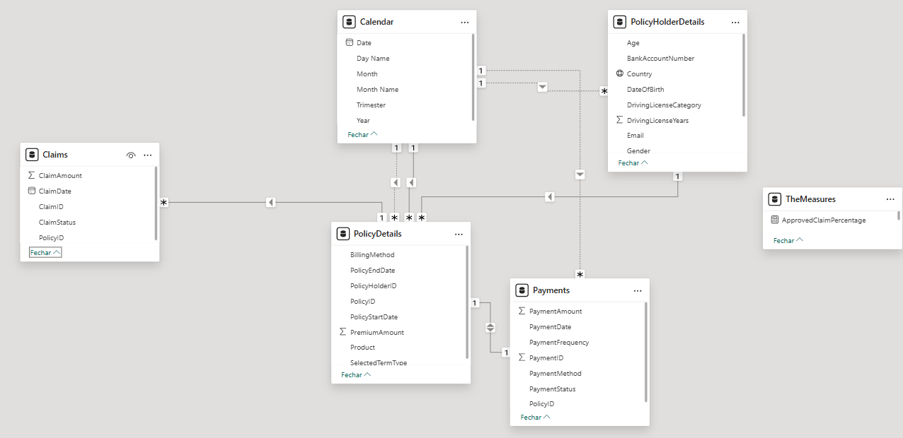

# GuardianSure Business Intelligence Project

## 📊 Overview
This project consists of developing a **Business Intelligence report in Power BI** using data from a fictitious insurance company called *GuardianSure*.
The goal is to transform raw data into strategic insights, enabling process optimization, trend identification, and data-driven decision-making.

---

## 📂 Work Includes
- 🔗 **Integration and modeling** of four main datasets
  (`PolicyHolderDetails`, `PolicyDetails`, `Claims`, `Payments`) in a **star schema**.
- 📈 **Definition of relevant KPIs** such as:
  - Claims Rate
  - Average Premium Value
  - Customer Lifetime Value (CLV)
  - Gross Profit Margin
- 📊 **Creation of interactive dashboards** covering multiple perspectives:
  - Customers
  - Claims
  - Policies
  - Payments
  - Gender
  - Age
  - Driving Experience
  - Profitability
- 🎛️ **Implementation of dynamic filters** by:
  - Country
  - Gender
  - Product
  - Time period

---

## ✅ Outcome
The final result is a set of **clear and actionable visualizations** that provide insights into the insurance business, following best practices in **data analysis and Business Intelligence visualization**.

---

## 🛠️ Tools & Technologies
- Power BI
- DAX (Data Analysis Expressions)
- Data Modeling (Star Schema)

---

## 🗂️ Data Model

The following star schema was used to organize the datasets:

